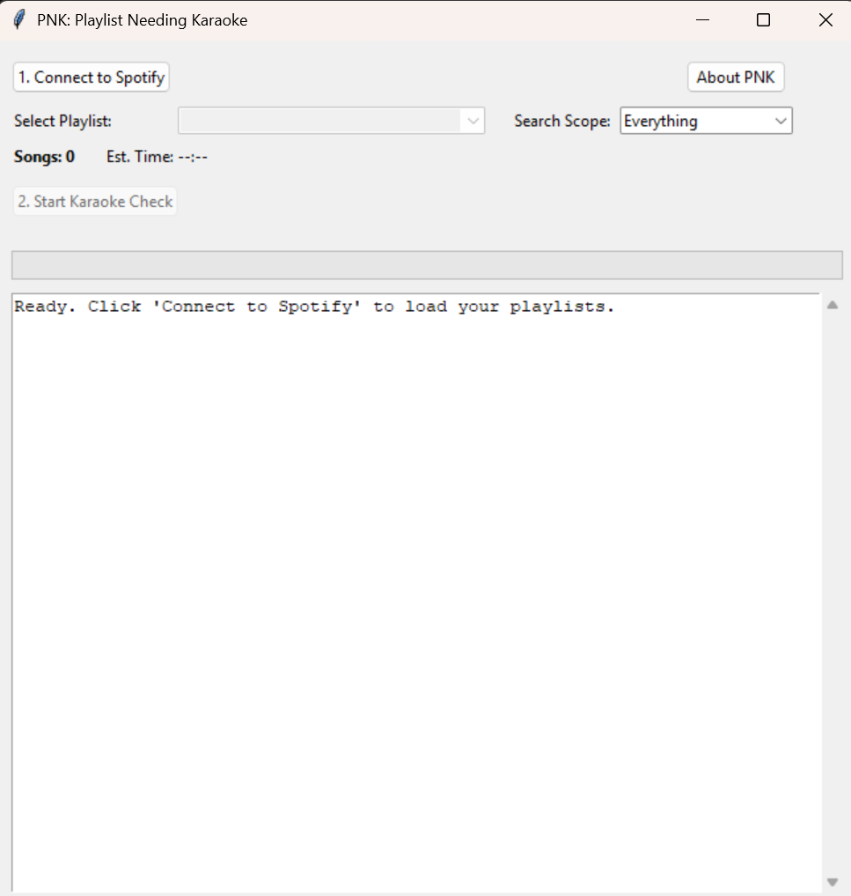

<h1 align="center">🎤 Playlist Needing Karaoke (PNK)</h1>

<p align="center">
    PNK is a lightweight desktop utility designed for karaoke enthusiasts and creators. It connects to your Spotify account, allows you to select any of your personal playlists (or your Liked Songs), and cross-references them against the KaraokeNerds database to generate a concise list of tracks that DO NOT currently have a karaoke version. 
</p>

<p align="center">
  
</p>

__________________________________________________________________________________________

### 📸 Main App Screenshot



__________________________________________________________________________________________

### ✨ What It Does
PNK eliminates the manual work of searching for karaoke availability. 

* 🎵 **Playlist Selection:** Dynamically pulls your custom Spotify playlists and "Saved Tracks". For YouTube, you will need to provide the link to a 'public' or 'unlisted' playlist. To check your YouTube 'Liked Music', just batch-select your songs, add them to an unlisted playlist, and paste the link.
* 🧠 **Fuzzy Logic Matching:** Uses `BeautifulSoup` and `difflib` to intelligently match artists and bypass strict search engine formatting (like "feat." tags).
* 📝 **Targeted Output:** Generates a `missing_karaoke_tracks.txt` file containing ONLY the songs that yielded zero matches.
* 🎚 **GUI Progress:** Features a clean, threaded user interface so you can monitor the search progress in real-time.
* 🚦 **Server Polite:** Built-in rate limiting ensures you don't overwhelm the KaraokeNerds search servers.

__________________________________________________________________________________________

### 📦 Installation & Setup

**1. Clone the repository and install dependencies:**
```bash
git clone https://github.com/mattjoykaraoke/PNK.git
cd PNK
pip install -r requirements.txt
```
For Windows, you can just download the latest release.

**2. Authenticate with Spotify:**
You will need to create a developer application on the [Spotify Developer Dashboard](https://developer.spotify.com/dashboard). 
* Create an app and set the **Redirect URI** to `http://127.0.0.1:8080`.
* Check the box for **Web API**.
* Create a `.env` file in the root directory of this project and add your credentials:

```text
SPOTIPY_CLIENT_ID=your_client_id_here
SPOTIPY_CLIENT_SECRET=your_client_secret_here
SPOTIPY_REDIRECT_URI=http://127.0.0.1:8080
```
No specific authentication is required for YouTube

**3. Run the App:**
```bash
python app.py
```

__________________________________________________________________________________________

### 🚫 What It Does NOT Do
* Does not download karaoke files.
* Does not modify your Spotify or YouTube playlists or saved tracks.
* Does not share your authentication keys (always keep your `.env` file local!).

__________________________________________________________________________________________

### 🧱 Technology
PNK is built with:
* **Python**
* **Tkinter** (Native Python GUI)
* **Requests & BeautifulSoup4** (Web Scraping & DOM Parsing)
* **Spotipy** (Data Extraction)
* **ytmusicapi** (Web Scraping)
* **Difflib** (Fuzzy String Matching)

__________________________________________________________________________________________

### 📜 Licensing
PNK is proprietary software.
© 2026 Matt Joy. All rights reserved.
YouTube: [youtube.com/@MattJoyKaraoke](https://www.youtube.com/@MattJoyKaraoke)

__________________________________________________________________________________________

### 💡 Design Philosophy
PNK is designed for the specific purpose of telling you what karaoke tracks you still need to make or wait for, streamlining your production workflow.
